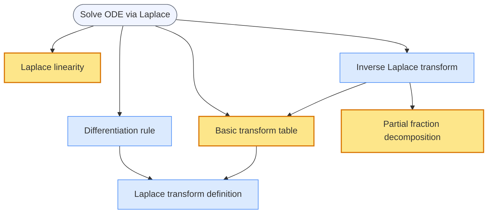

# benkyo (勉強, "study")

[](https://pypi.org/project/benkyo/)
[](https://pypi.org/project/benkyo/)
[](https://opensource.org/licenses/MIT)

**You can go deep without losing the syllabus.**

Drop your past exams, textbook, and syllabus into Claude Code. benkyo turns them into a persistent tutor that remembers what you decided to understand deeply, what to treat as a tool, and how far you are from the exam.

Ask an AI to help you study and it will answer whatever you ask — one "why?" leads to another and an hour later you're three prerequisites deep with no idea whether you'll make it back to the exam. Without structure, AI tutoring drifts.

benkyo keeps the dependency map visible throughout. You decide what to understand deeply and what to use as a tool. The path back to your goal never disappears — no matter how deep the breakdown goes.

## See it in action

> *First session, after dropping in lecture notes and practice problems:*

```
Claude: OK — goal is solving y'' + 3y' + 2y = e^(-t) with Laplace transforms.
        You said "I just need to be able to use it", so let's start practical.
        Quick calibration: what does ∫₀^∞ e^(-st) dt give you?

You:    1/s? The exponential decays to zero.

Claude: Exactly — that integral is the Laplace transform definition.
        Now apply L{} to both sides of the ODE.
        What does the y'' term become?

You:    L{y''} = s²Y(s) − sy(0) − y'(0) ... so s²Y − 1, with the initial conditions.

Claude: Right. Solve for Y(s), then partial fractions are in your reference table.
        Try it — I'll check your algebra.
```

The tutor read the project state from the database, calibrated in two questions, and handed the problem back — partial fractions are marked as a tool (amber in the graph), so it gave a table rather than a derivation.

At any point, ask to see the map (`show me the map` / `全体見せて`):



**Blue** = understand the why (derivation, proof). **Amber** = use the formula (tool). **Grey** = exam goal. The map doesn't disappear when you break down into a prerequisite — you always know where you are and how far remains.

Or drive it yourself:

```bash
benkyo render --project prj1 --format mermaid
benkyo render --project prj1 --format dot | dot -Tpng > graph.png
```

## Get started

**β** — CLI and skills are in English; Japanese-first interactions are the only evaluated end-to-end path. The agent adapts to the learner's language at runtime.

### 1. Install the CLI

```bash
uv tool install benkyo   # or: pipx install benkyo
benkyo --version
```

### 2. Install the skills

**Claude Code** (first-class support):

```bash
/plugin marketplace add youseiushida/benkyo
/plugin install benkyo
```

Restart Claude Code — the 5 skills appear in `/help`.

**Other agents** (OpenAI Codex CLI, Cursor, Gemini CLI, VS Code Copilot): the `SKILL.md` files use the open [Agent Skills](https://agentskills.io/) format. For Codex CLI, `codex plugin marketplace add youseiushida/benkyo` then install from the plugin directory. For Cursor and others, point your skill loader at `.claude/skills/benkyo-*` — the skills are agent-neutral and the repo carries `.codex-plugin/plugin.json` for Codex and `.claude/skills/` for everything else.

### 3. Drop your materials and start

Put your study materials — past exams, textbook PDF, syllabus, lecture notes — in the directory you launch Claude Code from, then just describe what you want:

```
You: I have the past 5 years of finals for ECE 220 (signals & systems),
     the textbook PDF, and the syllabus. The exam is in 12 days. Help me prep.
```

`benkyo-project-init` reads the materials, extracts the concept dependency graph, turns past-exam problems into goal problems, proposes the initial depth-of-understanding cut (which concepts to derive vs. which to use as tools), asks you to confirm, and hands off to tutoring.

## How it works

Two pieces that work together:

1. **`benkyo` CLI** — a Python tool (Click + SQLite + platformdirs) that owns the concept dependency graph, per-project depth-of-understanding decisions for each concept, goal problems, an append-only events log, and project metadata. Shared across sessions.
2. **5 Agent Skills** — `SKILL.md` playbooks that tell the agent when and how to drive the CLI on the learner's behalf. You talk naturally; the agent translates to CLI operations and applies rules grounded in published meta-analyses. The learner never types `benkyo` themselves.

### The 5 skills

| Skill | Triggers on | What it does |
|---|---|---|
| `benkyo-project-init` | "I want to study X" / "○○を勉強したい", materials shared, returning after a long gap | Reads materials, builds the concept graph, sets the initial understanding cut |
| `benkyo-tutoring` | Mid-session — "I don't get it" / "分からない", "explain" / "教えて", "next" / "次", "got it" / "分かった" | The in-session loop: problem-first or instruction-first mode, breakdown protocol, self-eval handling |
| `benkyo-treatment-shift` | "I want to really understand this" / "ちゃんと理解したい" (go deeper), "just the formula" / "公式でいい" (use as tool), or detected fatigue / transfer failure | Changes a concept's depth-of-engagement; ensures prerequisites exist before going deeper |
| `benkyo-graph-edit` | "Add this too" / "これも追加", "this is different" / "これは別物", or a concept mentioned that isn't in the graph | Adds nodes and edges with an identity check; granularity decisions |
| `benkyo-session-wrap` | "I'm done" / "終わり", "let's continue tomorrow" / "また明日", abrupt interruption | Recap, delayed confidence check, atomic persistence via `benkyo session end` |

Each `SKILL.md` references a shared library at `.claude/skills/_benkyo-shared/references/` — decision tables, natural-language ↔ internal-vocabulary map, and literature pointers. (Files prefixed `_` are not loaded as skills by Claude Code, so the bundle stays clean.)

### Architecture

```
Learner (natural language)
        ↓ ↑
Claude Code  ← skill auto-trigger by description
        ↓ ↑
    SKILL.md  → references/ (decision tables, nl-to-cli map, lit pointers)
        ↓
   benkyo CLI (read/write)
        ↓
   SQLite DB
```

**Domain model:**

- `concept_nodes` (`c1`, `c2`, …) — global, shared across projects; each has a `name` (short label for diagrams) and `content` (definition)
- `problem_nodes` (`p1`, `p2`, …) — also global
- `edges` — `prereq` (directed: X depends on Y) or `related` (undirected dashed: confusable/cooccurring pairs)
- `projects` (`prj1`, …) — owns goal problems and free-text metadata
- `project_concepts` — per-project depth: `blackbox` (use as tool) / `whitebox` (understand the why) / unset → default whitebox
- `events` — append-only log: `session_start`, `session_end`, `delayed_jol_recorded`, `hypercorrection_detected`, `treatment_changed`, `concept_probed`

The **window** is computed by BFS from goal problems via prereq edges; blackbox concepts terminate traversal (they bound what the tutor needs to teach). The `--scope project` seeds BFS from goals ∪ explicitly treated concepts without blackbox termination — showing the full project footprint. The `--scope graph` shows the entire global graph.

> **Vocabulary.** Two internal terms never appear in learner-facing speech: *whitebox* (understand the why) and *blackbox* (use as a tool). The skills translate these at runtime into the learner's natural language. In the research literature these map to Hiebert & Lefevre's (1986) *conceptual* and *procedural* knowledge respectively.

## Why it works this way

Each operational rule cites a published effect. The behavioral rules are explicit (in the `SKILL.md` files) rather than implicit (in model weights) — so the tutor's behavior is predictable and auditable.

| Rule | Source |
|---|---|
| Problem-first for concepts to understand; instruction-first for tool concepts | Sinha & Kapur (2021) |
| Build instruction on the learner's own attempt, not on the canonical solution | Sinha & Kapur (2021): g = 0.56 with instruction-building vs g = 0.20 without (subgroup p = .02) |
| Reduce scaffolding as the learner becomes fluent | Kalyuga (2007), expertise reversal |
| Rapid first-step diagnostic instead of long pre-tests | Kalyuga (2007), r up to 0.92 with full tests |
| Solicit a delayed confidence check at session end; verify at next session start | Rhodes & Tauber (2011), Hedges's g = 0.93 for delayed-over-immediate accuracy |
| Brief anticipation before showing a worked example | Bjork et al. (2013); Kornell et al. (2009) |
| Frame probes incidentally — never say "test" | Bertsch et al. (2007), d = 0.65 vs 0.32 |
| Interleave related concepts within a session | Brunmair & Richter (2019) |
| Explicit contrasting correction for high-confidence wrong answers | Butterfield & Metcalfe (2001), hypercorrection |
| Match probe format to intended use (TAP) | Adesope et al. (2017), g = 0.63 vs 0.53 |
| Treat learner self-evaluation as low-trust evidence | Bjork et al. (2013), 3 biases |

## Limitations

- **Japanese-first evaluation**: the `SKILL.md` files are in English (so any agent can read the instructions), but trigger phrases, eval prompts, and cardinal-vocabulary examples are Japanese-first. Claude / Codex adapt to the learner's language at runtime, so English-speaking learners can use benkyo today — but only Japanese end-to-end behavior has been formally evaluated. Localized example sets are a welcome contribution.
- **No probabilistic learner model**: benkyo stops at "events are queryable." It does not compute P(mastered) (BKT) or schedule reviews by a forgetting model (FSRS). Skills query the events log with simple heuristics. If you want a model, build it as a separate layer on top of the events log.
- **Self-managed scheduling**: spacing recommendations come from session-wrap heuristics, not from a per-card forgetting model. The 1–6 day Adesope window is a hint to the learner, not a queue.
- **Two-layer brittleness**: if the CLI surface changes and the skill's cheatsheet isn't updated, skill invocations will fail. Run the test suite + skill evals together on changes. `benkyo schema` lets skills introspect the live CLI shape.
- **Cross-agent behavior unverified end-to-end**: evals were run only in Claude Code. The Codex CLI install path is wired up but has not been load-tested in a real Codex session. Cursor / Gemini CLI / VS Code Copilot work in principle but are also unverified. PRs confirming or fixing cross-agent behavior are welcome.

## Development

```bash
uv sync --dev
uv run pytest                       # 192 tests
benkyo --help
benkyo schema                       # JSON tree of the full CLI surface
```

Skill files live at `.claude/skills/benkyo-*/SKILL.md`. Each skill has `evals/evals.json` (3 single-turn scenarios) and `evals/trigger-eval.json` (16 trigger discrimination cases) — see `_benkyo-shared/evals/TRIGGER-OPTIMIZATION.md` to run `example-skills:skill-creator`'s `run_loop.py` against them.

The full CLI reference is at `.claude/skills/_benkyo-shared/references/cli-cheatsheet.md` — or run `benkyo --help` / `benkyo schema`.

## References

Adesope, O. O., Trevisan, D. A., & Sundararajan, N. (2017). Rethinking the use of tests: A meta-analysis of practice testing. *Review of Educational Research*, *87*(3), 659–701. <https://doi.org/10.3102/0034654316689306>

Bertsch, S., Pesta, B. J., Wiscott, R., & McDaniel, M. A. (2007). The generation effect: A meta-analytic review. *Memory & Cognition*, *35*(2), 201–210. <https://doi.org/10.3758/BF03193441>

Bjork, R. A., & Bjork, E. L. (1992). A new theory of disuse and an old theory of stimulus fluctuation. In A. F. Healy, S. M. Kosslyn, & R. M. Shiffrin (Eds.), *From learning processes to cognitive processes: Essays in honor of William K. Estes* (Vol. 2, pp. 35–67). Erlbaum.

Bjork, R. A., Dunlosky, J., & Kornell, N. (2013). Self-regulated learning: Beliefs, techniques, and illusions. *Annual Review of Psychology*, *64*, 417–444. <https://doi.org/10.1146/annurev-psych-113011-143823>

Brunmair, M., & Richter, T. (2019). Similarity matters: A meta-analysis of interleaved learning and its moderators. *Psychological Bulletin*, *145*(11), 1029–1052. <https://doi.org/10.1037/bul0000209>

Butterfield, B., & Metcalfe, J. (2001). Errors committed with high confidence are hypercorrected. *Journal of Experimental Psychology: Learning, Memory, and Cognition*, *27*(6), 1491–1494. <https://doi.org/10.1037/0278-7393.27.6.1491>

Kalyuga, S. (2007). Expertise reversal effect and its implications for learner-tailored instruction. *Educational Psychology Review*, *19*(4), 509–539. <https://doi.org/10.1007/s10648-007-9054-3>

Murre, J. M. J., & Dros, J. (2015). Replication and analysis of Ebbinghaus' forgetting curve. *PLOS ONE*, *10*(7), e0120644. <https://doi.org/10.1371/journal.pone.0120644>

Rhodes, M. G., & Tauber, S. K. (2011). The influence of delaying judgments of learning on metacognitive accuracy: A meta-analytic review. *Psychological Bulletin*, *137*(1), 131–148. <https://doi.org/10.1037/a0021705>

Sinha, T., & Kapur, M. (2021). When problem solving followed by instruction works: Evidence for productive failure. *Review of Educational Research*, *91*(5), 761–798. <https://doi.org/10.3102/00346543211019105>

## License

MIT. See `LICENSE`.

The works cited in *References* belong to their respective authors and publishers. Cite the originals when reusing any quantitative claim.
